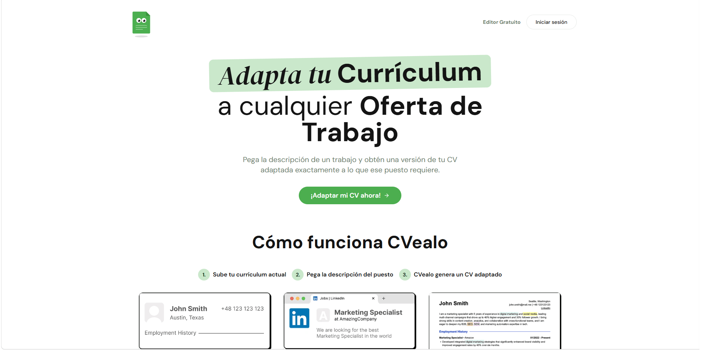

# Frontend Cvelo



**Cvelo** es una aplicación web inteligente diseñada para ayudar a los candidatos a destacar en sus procesos de selección, permitiéndoles adaptar sus currículums de forma precisa a las descripciones de ofertas de trabajo específicas.


## Stack Tecnológico

- **Frontend:** [React 18](https://reactjs.org/), [Vite](https://vitejs.dev/), [TypeScript](https://www.typescriptlang.org/).
- **Estilos y UI:** [Tailwind CSS](https://tailwindcss.com/), [shadcn/ui](https://ui.shadcn.com/), [Framer Motion](https://www.framer.com/motion/), [Lucide React](https://lucide.dev/).
- **Gestión de Estado y Rutas:** [React Query](https://tanstack.com/query/latest), [React Router DOM](https://reactrouter.com/), [React Hook Form](https://react-hook-form.com/), [Zod](https://zod.dev/).
- **Pruebas:** [Vitest](https://vitest.dev/)

## Instalación y Uso

1. **Clonar el repositorio:**
   ```bash
   git clone <url-del-repositorio>
   cd jobowl-perfect-clone
   ```

2. **Instalar dependencias:**
   ```bash
   npm install
   ```

3. **Iniciar el servidor de desarrollo:**
   ```bash
   npm run dev
   ```
4. **Generar el build optimizado para producción**
   ```bash
   npm run build
   ```

## Estructura del Proyecto

```text
src/
├── assets/         # Recursos estáticos (imágenes, logos)
├── components/     # Componentes reutilizables (UI, Auth, Dashboard, etc.)
├── hooks/          # Hooks personalizados de React
├── lib/            # Utilidades, clientes de API y tipos (DTOs, ViewModels)
├── pages/          # Componentes de página (rutas principales)
└── test/           # Configuración de pruebas
```